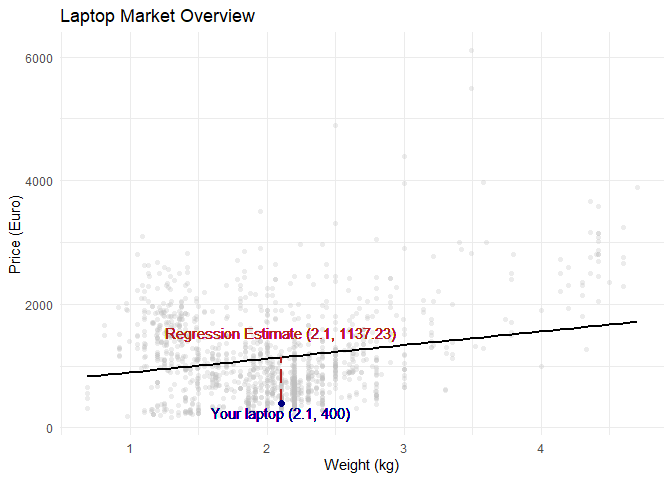
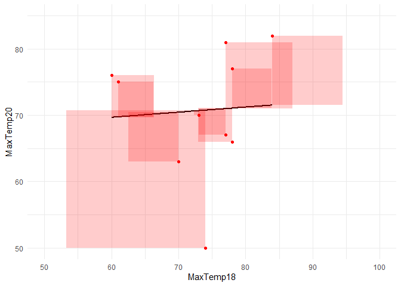
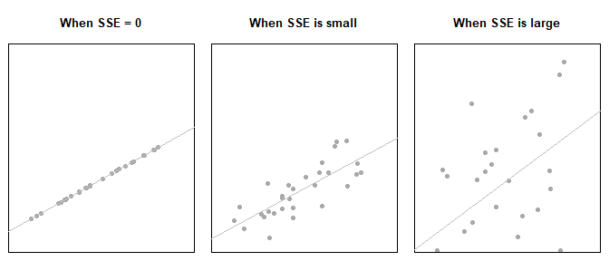
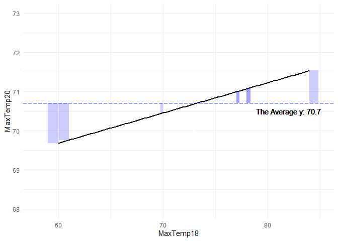
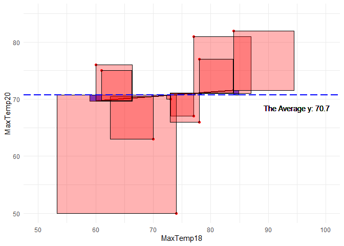
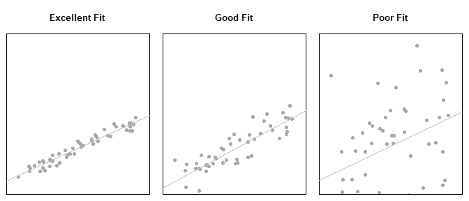

```r
library(ggplot2)
library(mosaic)
library(tidyverse)
library(pander)
library(DT)
library(readr)
laptops <- read_csv("../Data/laptops.csv")
laptops <- laptops %>% mutate(Weight_kg=parse_number(Weight))
Weather_Prediction <- read_csv("../Data/Weather Prediction.csv")
```

## {.tabset .tabset-fade}

### Residual

What is a residual? What use does a single residual provide within a regression analysis?

A residual is the difference between an observed value of ${Y_i}$ and the predicted, or estimated value, called $\hat{Y_i}$. In math equations, this can be expressed by: 

$$
r_i=\underbrace{Y_i}_{\substack{\text{Observed} \\ \text{Y-value}}}-\underbrace{\hat{Y_i}}_{\substack{\text{Predicted} \\ \text{Y-value}}}
$$

Residuals are everything in linear regression. Without residuals, there will be nothing to show in a linear regression.

Now, imagine you just spent 400 Euros on a new laptop that weighs 2.1 kg. You happen to have some market data on laptops and you want to see if you paid over, under, or right on average for what similar laptops cost. Let us look at this situation with a simple linear regression model.


```r
laptops.lm <- lm(Price_euros~Weight_kg, data=laptops)
```


```r
ggplot(laptops,aes(x=Weight_kg, y=Price_euros))+
  geom_point(size=1.5, color= "grey", alpha=0.3, pch=16)+
  geom_smooth(method="lm", formula=y~x, se=FALSE, color="black", size=1)+
  geom_segment(x=2.1, y=400, xend=2.1, yend=1137.23, size=1, color="firebrick",linetype="longdash")+
  geom_point(x=2.1, y=400, size=2, color="navy")+
  geom_text(x=2.1, y=250, label="Your laptop (2.1, 400)", color="navy", size=4)+
  geom_text(x=2.1, y=1537, label="Regression Estimate (2.1, 1137.23)", color="firebrick", size=4)+
  labs(title="Laptop Market Overview", x="Weight (kg)",y="Price (Euro)")+
  theme_minimal()
```

<!-- -->

The residual, in this situation, can be calculated by:

$$
r_i=\underbrace{400}_\text{Your laptop price}-\underbrace{1137.23}_{\substack{\text{Predicted average cost} \\ \text{based on weight}}}=-737.23
$$

You got a good deal! Among laptops that weigh 2.1 kg, you paid 737.23 Euros less than the average predicted price. Not only can residuals help us determine if we got a good deal, they can also tell us how good our estimated regression line is. To do this, we need to understand SSE, SSR, and SSTO.

### SSE, SSR & SSTO

#### SSE

SSE stands for "sum of squared errors." It measures how much the residuals deviate from the estimated line. Here is how to express the term mathematically:

$$
\text{SSE} = \sum_{i=1}^n \left(Y_i - \hat{Y}_i\right)^2
$$

And this is how SSE would show on a graph:


```r
weather.lm <- lm(MaxTemp20~MaxTemp18, data=Weather_Prediction)
```


```r
ggplot(Weather_Prediction,aes(x=MaxTemp18, y=MaxTemp20))+
  geom_point(size=1.5, color= "red", pch=16)+
  geom_smooth(method="lm", formula=y~x, se=FALSE, color="black", size=1)+
  geom_rect(data=Weather_Prediction, mapping=aes(xmin=MaxTemp18, xmax=MaxTemp18+weather.lm$residuals, ymin=MaxTemp20-weather.lm$residuals, ymax=MaxTemp20), fill="red", alpha=0.2)+
  xlim(50, 100)+
  ylim(50,85)+
  theme_minimal()
```

<!-- -->

As you can imagine, with different graphs, the size of your squares would be different as well. <span style="color:blue;">In real life, you want the SSE to be as small as possible. If SSE is equal to 0, that would mean that there is no deviation from the predicted line. While that is not really possible, a small SSE value shows that your model match the current data very well, which indicates that the model is good. On the other hand, a large SSE indicates that the model is not very well made. The above plot is an example of when SSE is large.</span>

<span style="color:blue;">Made some changes to the graph.</span>


```r
par(mfrow=c(1,3), mai=c(.1,.1,.5,.1))
set.seed(10)
x <- runif(30,0,20)
y1 <- 2 + 2.5*x
y2 <- 2 + 2.5*x + rnorm(30,0,10)
y3 <- 2 + 2.5*x + rnorm(30,0,40)
plot(y1 ~ x, pch=16, col="darkgray", xlim=c(-1,21), yaxt='n', xaxt='n', ylim=c(-10,100), main="When SSE = 0")
abline(lm(y1 ~ x), col="gray")
plot(y2 ~ x, pch=16, col="darkgray", xlim=c(-1,21), yaxt='n', xaxt='n', ylim=c(-10,100), main="When SSE is small")
abline(lm(y2 ~ x), col="gray")
plot(y3 ~ x, pch=16, col="darkgray", xlim=c(-1,21), yaxt='n', xaxt='n', ylim=c(-10,100), main="When SSE is large")
abline(lm(y3 ~ x), col="gray")
```

<!-- -->

<span style="color:blue;">Graph Reference: Statistics-Notebook-master/LinearRegression/Assessing the Fit of a Regression</span>

#### SSR

SSR stands for the "sum of squares regression." It measures how much the regression line deviates from the average y-value in the dataset.

$$
\text{SSR} = \sum_{i=1}^n \left(\hat{Y}_i - \bar{Y}\right)^2 
$$

And this is how SSR would show on a graph:


```r
ggplot(Weather_Prediction,aes(x=MaxTemp18, y=MaxTemp20))+
  geom_point(size=1.5, color= "white", pch=16)+
  geom_smooth(method="lm", formula=y~x, se=FALSE, color="black", size=1)+
  geom_rect(data=Weather_Prediction, mapping=aes(xmin=MaxTemp18, xmax=MaxTemp18+PreT20-70.7, ymin=PreT20, ymax=70.7), fill="blue", alpha=0.2)+
  xlim(50, 95)+ylim(50,85)+geom_hline(yintercept=70.7, color="blue", size=0.5, linetype="longdash")+
  geom_text(x=82, y=70.5, label="The Average y: 70.7")+
  coord_cartesian(xlim = c(58,85), ylim=c(68,73))+
  theme_minimal()
```

<!-- -->

Notice that in this graph, the squares are shown as rectangles. This is because the lengths of x axis and y axis are different. With the correct ratio, these boxes will appear as squares.

#### SSTO

SSTO stands for the total sum of squares. It measures how much the y-values deviate from the average y-value.

$$
\text{SSTO} = \sum_{i=1}^n \left(Y_i - \bar{Y}\right)^2
$$

And this is how SSTO would show on a graph:


```r
ggplot(Weather_Prediction,aes(x=MaxTemp18, y=MaxTemp20))+
  geom_point(size=1.5, color= "red", pch=16)+
  geom_smooth(method="lm", formula=y~x, se=FALSE, color="black", size=1)+
  geom_rect(data=Weather_Prediction, mapping=aes(xmin=MaxTemp18, xmax=MaxTemp18+MaxTemp20-70.7, ymin=70.7, ymax=MaxTemp20), fill="purple", color="black", alpha=0.3)+
  xlim(50, 100)+ylim(50,85)+
  geom_hline(yintercept=70.7, color="blue", size=1, linetype="longdash")+
  geom_text(x=95, y=68.5, label="The Average y: 70.7")+
  theme_minimal()
```

<!-- -->

It is important to know that SSTO is the sum of SSE and SSR. In other words, the Sum of Squared Errors plus the Sum of Squares Regression is equal to the Total Sum of Squares.

$$
\text{SSTO} = \text{SSE + SSR}
$$

If we add all the blue squares and red squares in this graph, the total would be equal to the sum of all the purple squares. To clarify, this does not mean a single blue square plus the corresponding red square would equal to the corresponding purple square. The function is only describing what would happen when we add **all** of the blue and red squares together.


```r
ggplot(Weather_Prediction,aes(x=MaxTemp18, y=MaxTemp20))+
  geom_point(size=1.5, color= "red", pch=16)+
  geom_smooth(method="lm", formula=y~x, se=FALSE, color="black", size=1)+
  geom_rect(data=Weather_Prediction, mapping=aes(xmin=MaxTemp18, xmax=MaxTemp18+PreT20-70.7, ymin=PreT20, ymax=70.7), fill="blue", color="black", alpha=0.7)+
  geom_rect(data=Weather_Prediction, mapping=aes(xmin=MaxTemp18, xmax=MaxTemp18+weather.lm$residuals, ymin=MaxTemp20-weather.lm$residuals, ymax=MaxTemp20), fill="red", color="black", alpha=0.3)+
  xlim(50, 100)+ylim(50,85)+
  geom_hline(yintercept=70.7, color="blue", size=1, linetype="longdash")+
  geom_text(x=95, y=68.5, label="The Average y: 70.7")+
  theme_minimal()
```

<!-- -->

### R-squared

#### R-squared

$R^2$ is the proportion of variation (unknown behavior) in y that the regression line is able to explain. 

There are two ways to calculate $R^2$. They are:

$$
R^2=\frac{SSR}{SSTO} \ \text{or} \ R^2=\frac{1-SSE}{SSTO}
$$

Know that $R^2$ can only be between 0 and 1. The closer $R^2$ is to 1, the more information the regression line is able to explain.

<span style="color:blue;"> Here is an example of R-squared equal to 0.004. </span>

<span style="color:blue;">Trying to add a R-squared graph, but do not really know how.</span>


#### Difference between R-squared and the p-value for the slope term

The p-value for the slope term gives us an idea about how likely the slope would occur out of complete randomness. $R^2$, on the other hand, provides insight about how informative the regression line is. In other words, the p-value for the slope tells us how likely this slope will occur out of randomness, while $R^2$ will tell us how good our regression line is.

#### Residual Standard Error (RSE)

The residual standard error (RSE) describes how well a regression line fits the dataset. The RSE will be small if the regression line is a good fit. 

<span style="color:blue;">Made some minor changes to the graph.</span>


```r
par(mfrow=c(1,3), mai=c(.1,.1,.5,.1))
set.seed(8)
x <- runif(50,0,20)
y1 <- 0 + 2*x + rnorm(50,0,3)
y2 <- 0 + 2*x + rnorm(50,0,7)
y3 <- 0 + 2*x + rnorm(50,0,30)
plot(y1 ~ x, pch=16, col="darkgray", xlim=c(-1,21), yaxt='n', xaxt='n', ylim=c(-10,100), main="Excellent Fit")
abline(lm(y1 ~ x), col="gray")
plot(y2 ~ x, pch=16, col="darkgray", xlim=c(-1,21), yaxt='n', xaxt='n', ylim=c(-10,100), main="Good Fit")
abline(lm(y2 ~ x), col="gray")
plot(y3 ~ x, pch=16, col="darkgray", xlim=c(-1,21), yaxt='n', xaxt='n', ylim=c(-10,100), main="Poor Fit")
abline(lm(y3 ~ x), col="gray")
```

<!-- -->

<span style="color:blue;">Graph Reference: Statistics-Notebook-master/LinearRegression/Assessing the Fit of a Regression</span>

In simple linear regression, the residual standard error is calculated by:

$$
\text{RSE} = \sqrt{\frac{\sum_{i=1}^n \left(Y_i - \hat{Y}_i\right)^2}{n-2}} \ \text{or} \ \text{RSE} = \sqrt{\frac{SSE}{\text{degree of freedom}}}
$$

At first glance, one might think the RSE and $R^2$ are describing the same thing. That is not correct. While it is true that both of them are trying to assess how good the regression model is, they look at the issue from two different perspectives. The RSE tries to describe how well the regression line fits the dataset, while $R^2$ focuses on understanding how well the x variable can explain the y variable. Overall, a good regression model should have a small RSE and an $R^2$ value that is close to 1.

